# Mikiri

[](https://github.com/takakhoo/mikiri-beats-katago/actions/workflows/tests.yml)

**Mikiri makes KataGo 263 Elo stronger at the same search budget, as much as KataGo gains from doubling its search. Same network, same search algorithm, no retraining.**

KataGo is the strongest open engine in the AlphaGo family: a policy and value network guiding a tree search. Like every engine in that family, it gives each move the same number of search visits. Mikiri wraps it and decides, move by move, when the search has seen enough. It plays settled moves at a quarter of the budget, keeps searching when the game is on the line, and never searches the same position twice.

Mikiri (見切り) is Japanese for the judgment that you have seen enough.


*One real game from the main match. Blue bars are Mikiri's visits per move. KataGo spends a fixed 200 on every move. At move 137 Mikiri climbs the whole ladder to 3,200 visits and sees its winrate estimate fall from 65% to 19%. It keeps thinking hard for the next few moves and goes on to win. Over the whole game both sides averaged about 200 visits per move.*

## The result

5,600 recorded games against KataGo on 19x19, both sides running the same network:

| Against KataGo at 200 visits per move | Games | Record (W-L-D) | Elo gain (95% interval) |
|---|---|---|---|
| **Mikiri at the same 200 visits, six-rung ladder** | 600 | 471-87-42 | **+263** (+230 to +301) |
| **Mikiri at the same 200 visits, four-rung ladder** | 1,000 | 728-196-76 | **+206** (+181 to +232) |
| **Mikiri at 160 visits, 20% fewer** (four-rung ladder) | 1,000 | 586-325-89 | **+93** (+72 to +114) |
| **Mikiri with move sampling switched off** (paired openings, four-rung ladder) | 800 | 561-183-56 | **+178** (+153 to +205) |
| KataGo given twice the visits, for scale | 400 | 310-73-17 | +237 (+198 to +280) |
| KataGo against itself, as a check on the harness | 400 | 185-183-32 | +2 (-30 to +35) |

- **At equal visits, Mikiri wins 82.0% of the points** with its six-rung ladder (50, 200, 400, 800, 1,600, 3,200) and 76.6% with the four-rung ladder (50, 200, 800, 3,200). The stopping rule is worth a full doubling of KataGo's search.
- **With 20% fewer visits it still wins 63.0%.**
- **It holds up under the strictest accounting.** Counting actual network evaluations, Mikiri at 100 per move gains +263 Elo. KataGo at 98 per move (283 visits) gains +108, and at 132 per move (400 visits) gains +237.
- **It is not an artifact of move sampling.** With both sides always playing their top move from 400 balanced openings, the gain is +178.

**Status.** This work is being prepared for submission to **IJCAI 2027** (paper deadline 11 January 2027). It has not been submitted or peer reviewed. The short version in IJCAI format is in [`paper/ijcai/`](paper/ijcai/), and the full technical report is [`paper/mikiri.pdf`](paper/mikiri.pdf). Every game behind every number is in [`results/matches/`](results/matches/).

## Contents

- [How it works](#how-it-works)
- [The science, step by step](#the-science-step-by-step)
- [Against prior stopping rules](#against-prior-stopping-rules)
- [Match results](#match-results)
- [Try it](#try-it)
- [What happened to v1](#what-happened-to-v1)
- [Reproduce](#reproduce)

## How it works

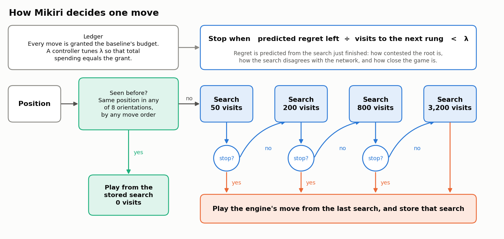

1. **Memory first.** If this exact position has been searched before, in any rotation or reflection and by any move order, Mikiri plays from the stored search and spends nothing.
2. **A ladder of budgets.** Otherwise it searches at 50 visits and asks a small model whether the decision is settled. If not, it searches at 200, then 800, then 3,200.
3. **A stopping rule with a price in it.** The model predicts how much winrate the current choice might still be giving up. Mikiri stops when that stake, divided by the visits needed to reach the next rung, falls below a threshold.
4. **A ledger.** Mikiri is granted the baseline's budget for every move, and a controller keeps its total spending at that grant. Visits saved on easy or remembered positions are spent on hard ones.

## The science, step by step

### 1. Search error is rare, and it is concentrated

We built a dataset to measure what more search buys: 6,000 positions from self-play, each searched at seven budgets from 50 to 3,200 visits. A search cannot grade itself, so every move any budget chose was scored by a separate search forced to start with that move. The gap to the best scored move is that budget's **regret**, in winrate.

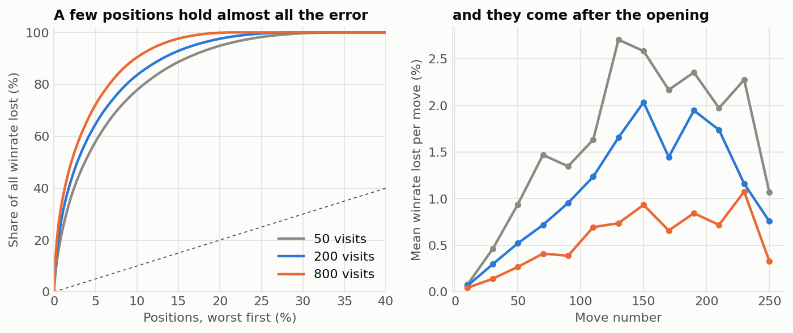

At 200 visits, 71% of positions have no regret at all, and the worst 10% hold 84% of it. Almost none of it is in the first 40 moves. A fixed budget spends most of its visits where they change nothing.

### 2. One position, up close

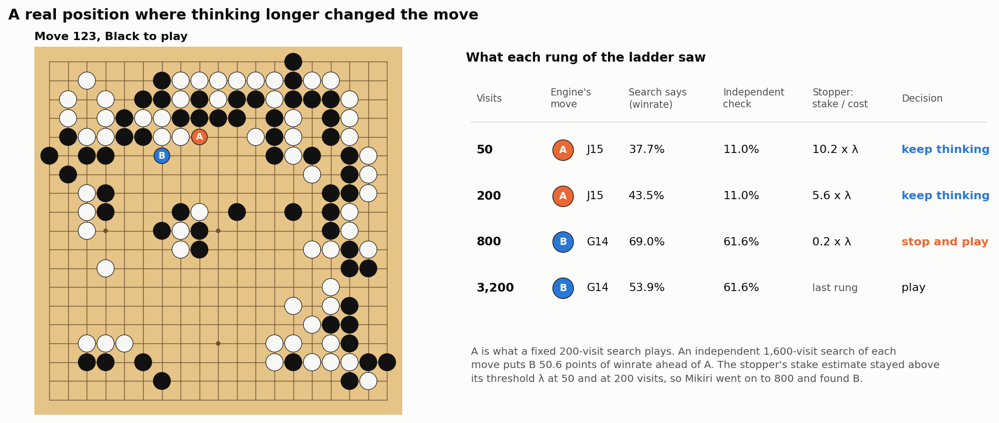

This is a real position from the dataset. At 50 and at 200 visits the engine plays A. The stopper's estimate of what is at stake stays far above its threshold, so Mikiri keeps going, and at 800 visits the engine finds B. An independent search rates B about 50 points of winrate better than A. A fixed 200-visit player gives all of that away.

### 3. The stopping rule

Mikiri stops at rung $j$ when

$$\frac{\hat r_j(x)}{v_{j+1}-v_j} < \lambda$$

where $\hat r_j(x)$ is the predicted regret left at this rung, $v_{j+1}-v_j$ is the number of visits the next rung would add, and $\lambda$ is the exchange rate between winrate and visits. One $\lambda$ prices every decision on the ladder the same way: going from 800 to 3,200 visits needs four times the stake that going from 200 to 800 does.

That division is the most important design choice in the project.

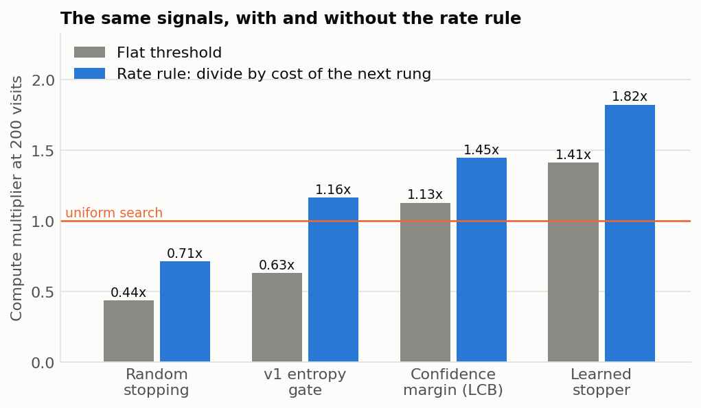

The bars show how many times more visits uniform search needs to match each rule (above 1.0 is a gain). With a flat threshold, the entropy gate from v1 of this project is worse than no gate, and random stopping is far worse. With the rate rule, even a hand-written confidence margin beats uniform search by 1.45x, and the learned model reaches 1.82x.

### 4. Training the stopper

The model is a gradient-boosted tree regressor on statistics the search already produced: how contested the root is, how the search disagrees with the network's prior, how close the game is, and how the answer changed since the previous rung. It is fitted to the square root of regret, which keeps a handful of enormous blunders from dominating. It is stored as JSON and evaluated in NumPy, with no pickle and no ML framework at play time.

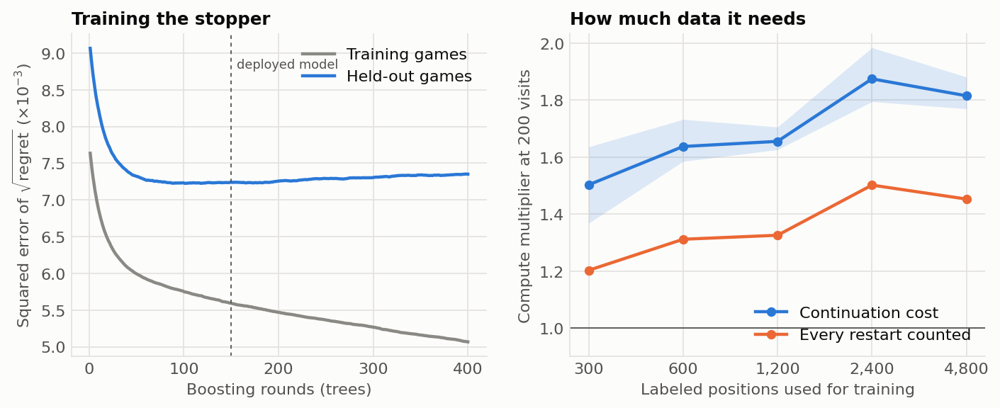

Left: error on held-out games levels off after about 100 trees. We deploy 150. Right: with only 300 labeled positions the stopper already reaches 1.50x, and with 4,800 it reaches 1.82x. The band shows the spread over three random draws of training games.

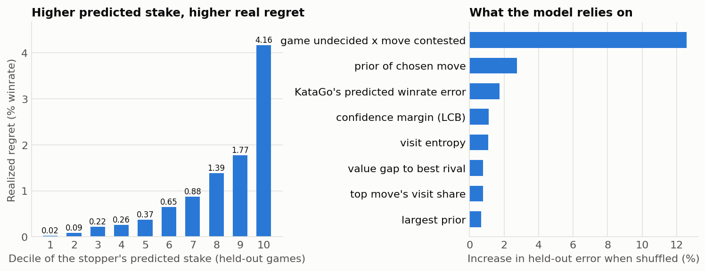

Left: on games the model never saw, positions it scores higher really do carry more regret, from 0.02% of winrate in the lowest tenth to 4.2% in the highest. Right: the model leans mostly on one signal, the product of how undecided the game is and how contested the move is. Ablations agree: seven features do nearly as well as all of them, and 80 depth-2 trees do as well as 400 depth-3 trees. The rule matters more than the model.

### 5. What it buys, offline

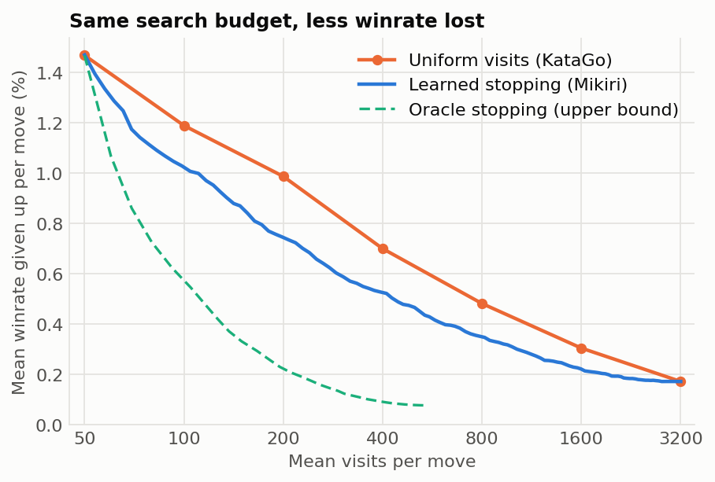

At a mean cost of 200 visits the stopper gives up as little winrate as uniform search at 358 visits, a factor of 1.8. The factor stays between 1.7 and 1.9 from 100 to 800 visits (1.3 to 1.5 if every restarted search is charged in full). All of it is cross-fitted: each position is scored by a model that never saw its game.

The dashed line is a stopper that knows the true regret. It reaches 12x. Most of that gap is invisible to any rule that reads search statistics: over half of the surviving regret sits on moves the shallow search gave less than 10% of its visits.

### 6. Memory: exact positions only

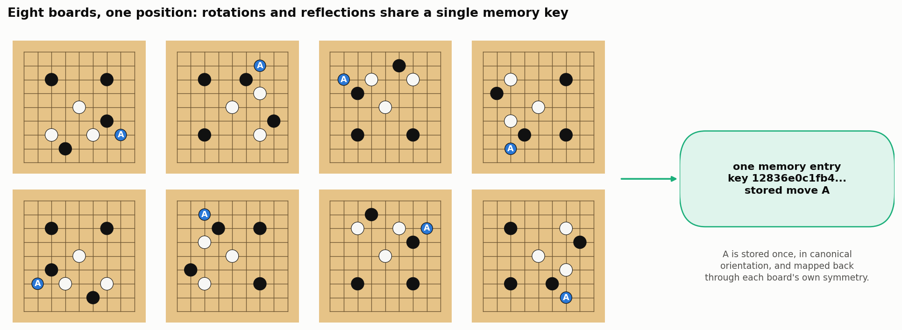

Stored searches are keyed on a canonical form of the position, so rotations, reflections, and transpositions all hit the same entry. Positions recur more than you might expect:

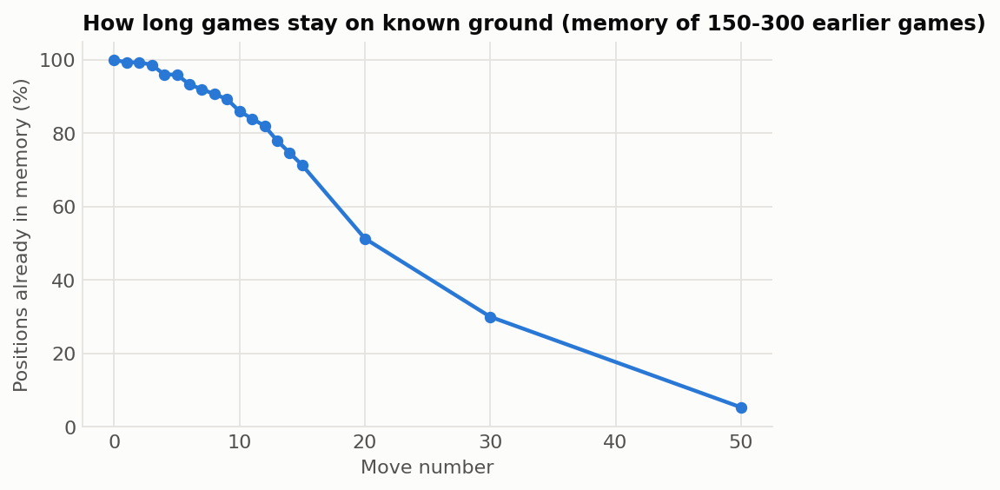

Across 300 self-play games, a position at move 10 had been seen before 86% of the time and at move 20 half the time. Overall 11.5% of all positions were repeats.

The original idea behind this project was *approximate* retrieval: find similar stored positions and reuse their analysis. We tested it directly and it does not work for a frozen engine.

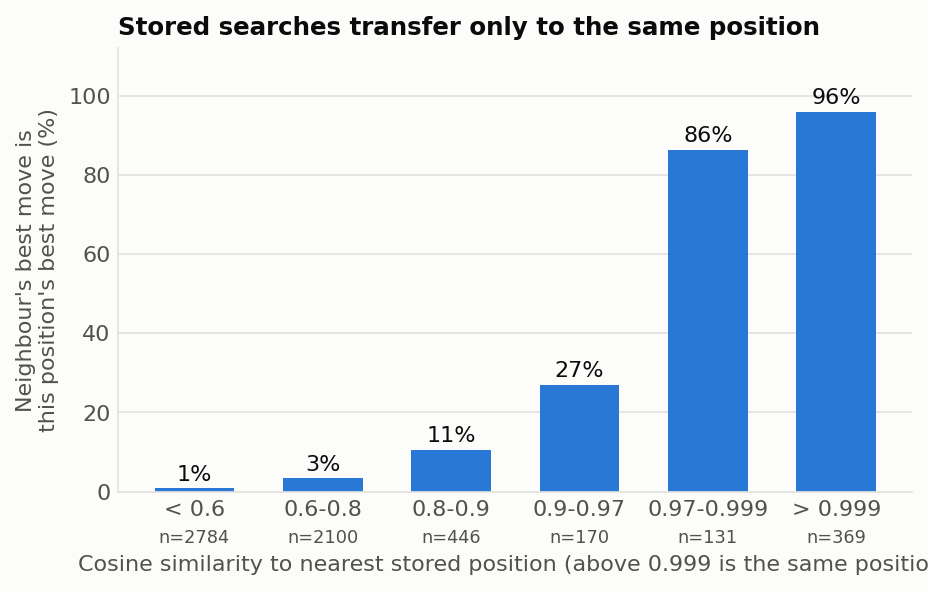

When the shallow and deep search disagree, the most similar stored position has the right move 5.5% of the time. The policy network's own second choice has it 43% of the time. Transfer is reliable only when the stored position is the same position, which the exact key already finds.

In play, memory alone (no stopper) served 21% of Mikiri's moves over 600 games with no change in strength (-9 Elo, -37 to +19). It saves search visits. It does not save network evaluations (69 per move against 69), because KataGo already caches evaluations of positions it has seen. The strength comes from the stopping rule.

## Against prior stopping rules

We re-implemented ten published rules for deciding how long to search, from their papers and source code, and ran them on the same dataset with the same scoring. Each threshold was swept so every rule is shown at its best. Numbers are how many times more visits uniform search needs to match the rule at a 200-visit mean budget (above 1.0 is a gain), with 95% intervals.

| Rule | Source | Multiplier at 200 visits |
|---|---|---|
| Value-of-information stop | Hay et al. 2012 | 0.34x (0.30 to 0.40) |
| Best-arm-identification stop | Kaufmann and Koolen 2017 | 0.77x (0.63 to 1.01) |
| Think longer when behind | Huang et al. 2010 | 0.89x at 174 visits |
| Stop when the runner-up cannot catch up | Baier and Winands 2016 | 1.25x at 134 visits |
| Smart pruning | Leela Chess Zero | 1.17x at 159 visits |
| Extend when the top two are close | Baier and Winands 2016 | 1.15x at 229 visits |
| Extend when most-visited is not best-valued | Huang et al. 2010 | 1.21x at 239 visits |
| KL-gain stop | Leela Chess Zero | 1.32x (1.18 to 1.49) |
| Budget chosen before search | in the spirit of Muppidi et al. 2026 | 1.18x (0.97 to 1.40) |
| Learned move-stability classifier | DS-MCTS, Lan et al. 2021 | 1.48x (1.28 to 1.73) |
| Virtual expansion, published settings | V-MCTS, Ye et al. 2022 | 1.60x (1.44 to 1.76) |
| **Mikiri** | this work | **2.13x (1.88 to 2.41)** |

Two things stand out. Mikiri is ahead of the strongest prior rule, V-MCTS at its published settings, by 0.54 (0.28 to 0.84) in a paired test over the same games. And Mikiri's rate rule improves other people's signals too: it lifts the DS-MCTS-style classifier from 1.48x to 1.75x.

These are re-implementations from root search statistics on KataGo, with the adaptations listed in the paper. The two strongest are also being played against KataGo directly, and those match results are added to the table below as they finish.

## Match results

The offline analysis predicted a gain. These are the played games that confirm it: from the empty board, alternating colors, each player on its own KataGo process.

Compute is reported three ways because the answer depends on how you count. **Visits** is the size of the deepest search per move. **Restart visits** charges every search Mikiri requested, including smaller ones it later extended. **NN evals** is the number of network evaluations each player's KataGo process actually ran.

| Player | vs | Games | W-L-D | Score | Elo (95% CI) | Visits/move | Restart visits/move | NN evals/move (it : baseline) |
|---|---|---|---|---|---|---|---|---|
| KataGo 100 visits | KataGo 200 | 400 | 77-301-22 | 0.220 | -220 (-262 to -181) | 100 | 100 | 40 : 71 |
| KataGo 200 visits | KataGo 200 | 400 | 185-183-32 | 0.502 | +2 (-30 to +35) | 200 | 200 | 76 : 76 |
| KataGo 283 visits | KataGo 200 | 400 | 247-126-27 | 0.651 | +108 (+76 to +143) | 283 | 283 | 98 : 73 |
| KataGo 400 visits | KataGo 200 | 400 | 310-73-17 | 0.796 | +237 (+198 to +280) | 400 | 400 | 132 : 73 |
| Mikiri (stopper), 200-visit grant, six-rung ladder | KataGo 200 | 600 | 471-87-42 | 0.820 | +263 (+230 to +301) | 201 | 305 | 100 : 76 |
| Mikiri (stopper), 200-visit grant | KataGo 200 | 1000 | 728-196-76 | 0.766 | +206 (+181 to +232) | 200 | 251 | 99 : 74 |
| Mikiri (stopper), 160-visit grant | KataGo 200 | 1000 | 586-325-89 | 0.630 | +93 (+72 to +114) | 160 | 197 | 80 : 74 |
| Mikiri (memory), 200-visit grant | KataGo 200 | 600 | 276-292-32 | 0.487 | -9 (-37 to +19) | 158 | 158 | 69 : 69 |
| Mikiri (stopper), 200-visit grant, paired openings, no sampling | KataGo 200 | 800 | 561-183-56 | 0.736 | +178 (+153 to +205) | 200 | 250 | 115 : 96 |

*More runs are still in progress and will be added to this table: the full system with memory, other budgets, the b28 network, and smaller boards.*

The paired-openings row is a control. Both players always play their engine's top move from 400 balanced openings, each played twice with colors swapped, so the gain cannot come from how moves are sampled.

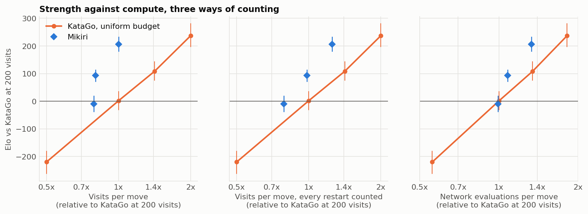

The orange line is KataGo at uniform budgets. Both Mikiri runs sit above it under all three ways of counting. At about the same network evaluations per move (99 against 98), Mikiri gains +206 Elo where KataGo at 283 visits gains +108.

**The offline analysis called it.** From the dataset alone, before a single match game, the regret numbers forecast +197 Elo for the main match. The match gave +206.

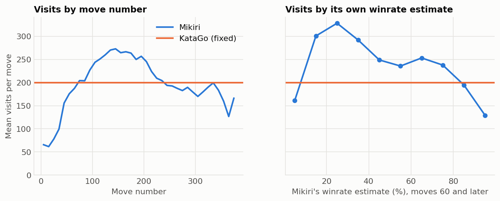

Nobody told Mikiri to save visits in the opening or to ease off once a game is decided. Both fall out of predicting regret in winrate units: it averages about 65 visits over the first 20 moves, peaks near 270 around move 140, and drops to about 130 when it rates its own winrate above 90%.

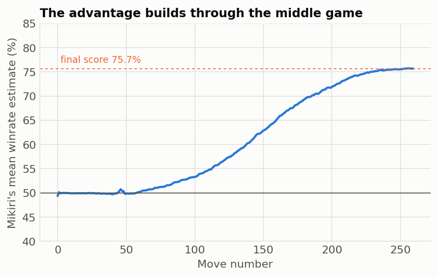

The edge is the same with either color (76.2% as Black, 77.0% as White) and it builds where the visits go: level through the opening, then climbing steadily from about move 70.

## Try it

Replay the demo game move by move in a terminal. No GPU, no KataGo:

```bash
pip install -e .
python -m mikiri.demo --replay results/demo/game.json
```

```
=== Recorded game: Mikiri (Black) vs KataGo (White), komi 7.0 ===
   1 Mikiri  B Q16   winrate  48.9%  settled at 50 visits
   2 KataGo  W D4    winrate  51.7%  200 visits
   3 Mikiri  B Q4    winrate  48.3%  kept thinking: 50 -> 200 visits
   4 KataGo  W D16   winrate  51.5%  200 visits
   5 Mikiri  B C17   winrate  48.4%  settled at 50 visits
   6 KataGo  W D17   winrate  51.4%  200 visits
   ...
 133 Mikiri  B J10   winrate  64.3%  kept thinking: 50 -> 200 visits
 134 KataGo  W K18   winrate  36.9%  200 visits
 135 Mikiri  B H18   winrate  64.7%  kept thinking: 50 -> 200 visits
 136 KataGo  W M18   winrate  42.7%  200 visits
 137 Mikiri  B N17   winrate  19.3%  kept thinking: 50 -> 200 -> 800 -> 3200 visits
 138 KataGo  W F16   winrate  77.3%  200 visits
 139 Mikiri  B M17   winrate  25.6%  kept thinking: 50 -> 200 -> 800 visits
 140 KataGo  W L16   winrate  80.3%  200 visits
 141 Mikiri  B J18   winrate  23.1%  kept thinking: 50 -> 200 -> 800 visits
   ...
Result: Mikiri (Black) wins by resignation
  Mikiri: 201.7 visits per move over 89 moves
  KataGo: 200.0 visits per move over 89 moves
```

Watch the mechanics against a toy engine, or play live against a real KataGo:

```bash
python -m mikiri.demo --fake --games 2
python -m mikiri.demo --net b18 --stopper models/stopper_b18.json --games 2
```

## What happened to v1

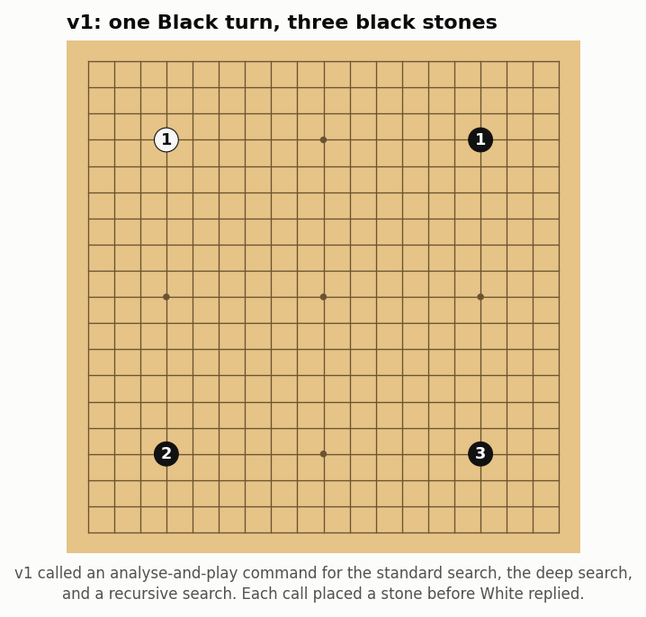

The first version of this project, called DataGo, reported 9-0-1 and 8-0-2 records against KataGo. Those came from a bug. Its match runner analysed positions with a GTP command that also plays a move, so the standard search, the deep search, and each recursive search all placed a stone before White replied. Retrieved moves were never sent to the engine at all.

[`legacy/AUDIT.md`](legacy/AUDIT.md) walks through it, and [`legacy/audit/reproduce_double_move.py`](legacy/audit/reproduce_double_move.py) reproduces it with v1's own code: three black stones after one Black turn. v1 is preserved unchanged in [`legacy/v1/`](legacy/v1/). None of its numbers are used here.

<br clear="right">

## Reproduce

```bash
pip install -e ".[dev,experiments]"
python -m pytest -q        # 26 tests against a toy engine, no GPU
```

For real runs set `KATAGO` (path to a KataGo 1.18 binary) and `MIKIRI_HOME` (a directory with `nets/` holding the networks named in [`mikiri/engine.py`](mikiri/engine.py)).

| Step | Command | GPU time (one RTX 6000 Ada) |
|---|---|---|
| Self-play positions | `python experiments/collect.py games --n 300 --out runs/data/games19.jsonl` | 15 min |
| Ladder dataset | `python experiments/collect.py label --games runs/data/games19.jsonl --out runs/data/ladder19.jsonl` | 1.5 h |
| Train the stopper | `python experiments/train_stopper.py data/ladder19.jsonl.gz --export 50,200,800,3200:sqrt` | none |
| Main match | `python experiments/series.py --name main_200 --games 1000 --budget 200 --path 50,200,800,3200 --stopper models/stopper_b18.json --control` | 1.5 h |
| Tables, figures, paper | `experiments/build_paper.sh` | none |

The dataset and trained model ship in [`data/`](data/) and [`models/`](models/), so the first three steps are optional.

```
mikiri/        the engine wrapper: board, KataGo client, stopper, memory, players, matches
experiments/   scripts behind every number, table, and figure
data/          the ladder dataset and the games it was drawn from
models/        trained stopping models (JSON)
results/       match records, analysis reports, figures
paper/         LaTeX source and PDF
legacy/        v1, unchanged, and the audit of its results
tests/         26 tests that run the whole pipeline against a toy engine
```

## Scope

- Measured on KataGo networks at 100 to 800 visits per move, against KataGo itself. That is fast-play territory, where each doubling of search is worth about 230 Elo. Tournament-scale budgets are the next thing to test.
- AlphaGo itself is not available to play, so the comparison is with KataGo, the strongest open engine built on its design.
- Regret in the offline analysis is measured by a search. The match results do not depend on it.

## Credits

v2 (this rebuild, the experiments, and the paper) is by Taka Khoo. The first version, preserved in [`legacy/v1/`](legacy/v1/), was a team project by Benjamin Huh, Jason Peng, Taka Khoo, Olir Eswaramoorthy, David Roos, and Victor Lun Pun at the Thayer School of Engineering, Dartmouth College. Experiments ran on the Dartmouth LISP Lab's machines. KataGo and its networks are the work of David J. Wu and the KataGo community.
